# 📐 DIAGRAMMES DE SÉQUENCE — BuildFlow

> Basé sur l'analyse du code source (controllers, modèles, routes, observers).
> Stack : Laravel 11 / Bootstrap 5 / Alpine.js
> Dernière mise à jour : 6 juin 2026

---

## Table des matières

1. [Authentification — Login](#1-authentification--login)
2. [Réinitialisation du mot de passe](#2-réinitialisation-du-mot-de-passe)
3. [Cycle de vie d'un Devis](#3-cycle-de-vie-dun-devis)
4. [Versioning automatique d'un Devis](#4-versioning-automatique-dun-devis)
5. [Validation Client d'un Devis (lien public)](#5-validation-client-dun-devis-lien-public)
6. [Auto-génération des Tâches depuis un Devis accepté](#6-auto-génération-des-tâches-depuis-un-devis-accepté)
7. [Conversion Devis → Facture](#7-conversion-devis--facture)
8. [Cycle de vie d'une Facture](#8-cycle-de-vie-dune-facture)
9. [Enregistrement d'un Paiement](#9-enregistrement-dun-paiement)
10. [Cycle de vie d'une Dépense (workflow validation)](#10-cycle-de-vie-dune-dépense-workflow-validation)
11. [Bon de Commande → Dépense automatique](#11-bon-de-commande--dépense-automatique)
12. [Cycle de vie d'un Chantier](#12-cycle-de-vie-dun-chantier)
13. [Cycle de vie d'un Avenant](#13-cycle-de-vie-dun-avenant)
14. [PV de Réception & Libération de la Retenue de Garantie](#14-pv-de-réception--libération-de-la-retenue-de-garantie)
15. [Mouvement de Stock (Entrée / Sortie)](#15-mouvement-de-stock-entrée--sortie)
16. [Transfert de Stock entre Dépôts](#16-transfert-de-stock-entre-dépôts)
17. [Calcul DBE (Coefficient K) — AJAX](#17-calcul-dbe-coefficient-k--ajax)
18. [Pointage d'un Salarié](#18-pointage-dun-salarié)
19. [Upload sécurisé d'un Document](#19-upload-sécurisé-dun-document)
20. [Notification in-app (cloche topbar)](#20-notification-in-app-cloche-topbar)
21. [Expiration automatique des Devis (Scheduler)](#21-expiration-automatique-des-devis-scheduler)

---

## 1. Authentification — Login

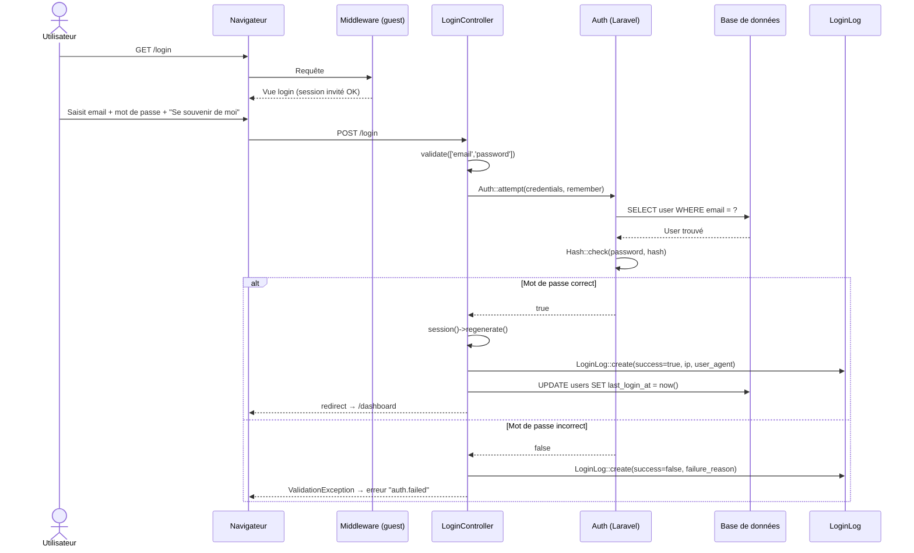
```mermaid
sequenceDiagram
    actor U as Utilisateur
    participant B as Navigateur
    participant M as Middleware (guest)
    participant LC as LoginController
    participant Auth as Auth (Laravel)
    participant DB as Base de données
    participant LL as LoginLog

    U->>B: GET /login
    B->>M: Requête
    M-->>B: Vue login (session invité OK)
    U->>B: Saisit email + mot de passe + "Se souvenir de moi"
    B->>LC: POST /login
    LC->>LC: validate(['email','password'])
    LC->>Auth: Auth::attempt(credentials, remember)
    Auth->>DB: SELECT user WHERE email = ?
    DB-->>Auth: User trouvé
    Auth->>Auth: Hash::check(password, hash)

    alt Mot de passe correct
        Auth-->>LC: true
        LC->>LC: session()->regenerate()
        LC->>LL: LoginLog::create(success=true, ip, user_agent)
        LC->>DB: UPDATE users SET last_login_at = now()
        LC-->>B: redirect → /dashboard
    else Mot de passe incorrect
        Auth-->>LC: false
        LC->>LL: LoginLog::create(success=false, failure_reason)
        LC-->>B: ValidationException → erreur "auth.failed"
    end
```

---

## 2. Réinitialisation du mot de passe

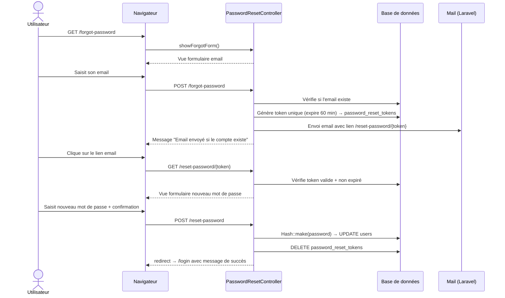
```mermaid
sequenceDiagram
    actor U as Utilisateur
    participant B as Navigateur
    participant PRC as PasswordResetController
    participant DB as Base de données
    participant Mail as Mail (Laravel)

    U->>B: GET /forgot-password
    B->>PRC: showForgotForm()
    PRC-->>B: Vue formulaire email

    U->>B: Saisit son email
    B->>PRC: POST /forgot-password
    PRC->>DB: Vérifie si l'email existe
    PRC->>DB: Génère token unique (expire 60 min) → password_reset_tokens
    PRC->>Mail: Envoi email avec lien /reset-password/{token}
    PRC-->>B: Message "Email envoyé si le compte existe"

    U->>B: Clique sur le lien email
    B->>PRC: GET /reset-password/{token}
    PRC->>DB: Vérifie token valide + non expiré
    PRC-->>B: Vue formulaire nouveau mot de passe

    U->>B: Saisit nouveau mot de passe + confirmation
    B->>PRC: POST /reset-password
    PRC->>DB: Hash::make(password) → UPDATE users
    PRC->>DB: DELETE password_reset_tokens
    PRC-->>B: redirect → /login avec message de succès
```

---

## 3. Cycle de vie d'un Devis

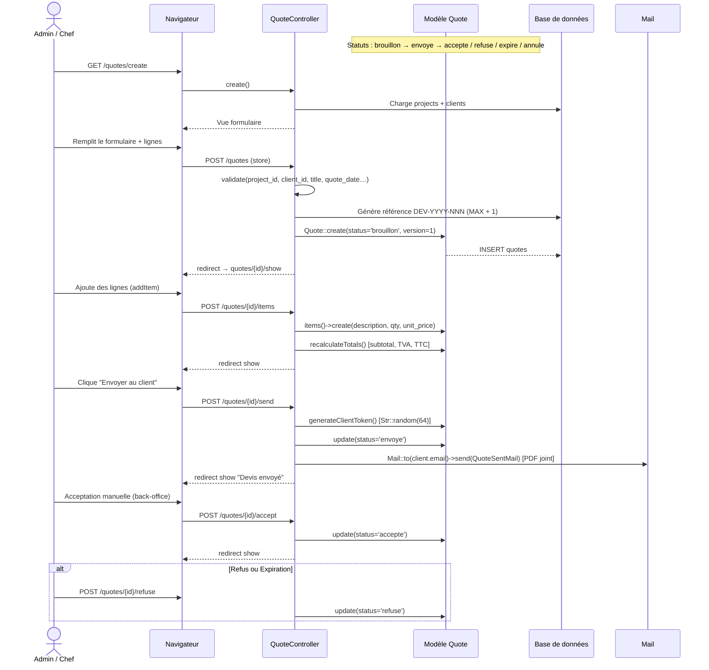
```mermaid
sequenceDiagram
    actor Admin as Admin / Chef
    participant B as Navigateur
    participant QC as QuoteController
    participant Q as Modèle Quote
    participant DB as Base de données

    Note over Q: Statuts : brouillon → envoye → accepte / refuse / expire / annule

    Admin->>B: GET /quotes/create
    B->>QC: create()
    QC->>DB: Charge projects + clients
    QC-->>B: Vue formulaire

    Admin->>B: Remplit le formulaire + lignes
    B->>QC: POST /quotes (store)
    QC->>QC: validate(project_id, client_id, title, quote_date…)
    QC->>DB: Génère référence DEV-YYYY-NNN (MAX + 1)
    QC->>Q: Quote::create(status='brouillon', version=1)
    Q-->>DB: INSERT quotes
    QC-->>B: redirect → quotes/{id}/show

    Admin->>B: Ajoute des lignes (addItem)
    B->>QC: POST /quotes/{id}/items
    QC->>Q: items()->create(description, qty, unit_price)
    QC->>Q: recalculateTotals() [subtotal, TVA, TTC]
    QC-->>B: redirect show

    Admin->>B: Clique "Envoyer au client"
    B->>QC: POST /quotes/{id}/send
    QC->>Q: generateClientToken() [Str::random(64)]
    QC->>Q: update(status='envoye')
    QC->>Mail: Mail::to(client.email)->send(QuoteSentMail) [PDF joint]
    QC-->>B: redirect show "Devis envoyé"

    Admin->>B: Acceptation manuelle (back-office)
    B->>QC: POST /quotes/{id}/accept
    QC->>Q: update(status='accepte')
    QC-->>B: redirect show

    alt Refus ou Expiration
        Admin->>B: POST /quotes/{id}/refuse
        QC->>Q: update(status='refuse')
    end
```

---

## 4. Versioning automatique d'un Devis

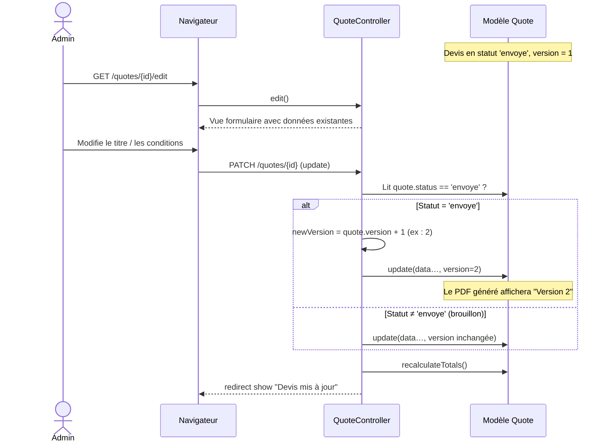
```mermaid
sequenceDiagram
    actor Admin as Admin
    participant B as Navigateur
    participant QC as QuoteController
    participant Q as Modèle Quote

    Note over Q: Devis en statut 'envoye', version = 1

    Admin->>B: GET /quotes/{id}/edit
    B->>QC: edit()
    QC-->>B: Vue formulaire avec données existantes

    Admin->>B: Modifie le titre / les conditions
    B->>QC: PATCH /quotes/{id} (update)
    QC->>Q: Lit quote.status == 'envoye' ?

    alt Statut = 'envoye'
        QC->>QC: newVersion = quote.version + 1 (ex : 2)
        QC->>Q: update(data…, version=2)
        Note over Q: Le PDF généré affichera "Version 2"
    else Statut ≠ 'envoye' (brouillon)
        QC->>Q: update(data…, version inchangée)
    end

    QC->>Q: recalculateTotals()
    QC-->>B: redirect show "Devis mis à jour"
```

---

## 5. Validation Client d'un Devis (lien public)

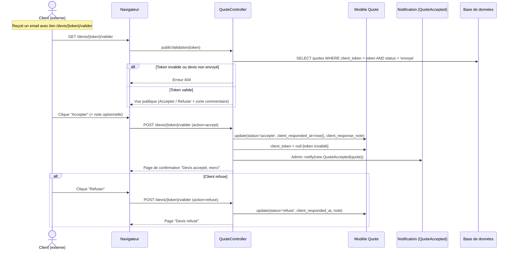
```mermaid
sequenceDiagram
    actor Client as Client (externe)
    participant B as Navigateur
    participant QC as QuoteController
    participant Q as Modèle Quote
    participant Notif as Notification (QuoteAccepted)
    participant DB as Base de données

    Note over Client: Reçoit un email avec lien /devis/{token}/valider

    Client->>B: GET /devis/{token}/valider
    B->>QC: publicValidation(token)
    QC->>DB: SELECT quotes WHERE client_token = token AND status = 'envoye'

    alt Token invalide ou devis non envoyé
        QC-->>B: Erreur 404
    else Token valide
        QC-->>B: Vue publique (Accepter / Refuser + zone commentaire)
    end

    Client->>B: Clique "Accepter" (+ note optionnelle)
    B->>QC: POST /devis/{token}/valider (action=accept)
    QC->>Q: update(status='accepte', client_responded_at=now(), client_response_note)
    QC->>Q: client_token = null [token invalidé]
    QC->>Notif: Admin::notify(new QuoteAccepted(quote))
    QC-->>B: Page de confirmation "Devis accepté, merci"

    alt Client refuse
        Client->>B: Clique "Refuser"
        B->>QC: POST /devis/{token}/valider (action=refuse)
        QC->>Q: update(status='refuse', client_responded_at, note)
        QC-->>B: Page "Devis refusé"
    end
```

---

## 6. Auto-génération des Tâches depuis un Devis accepté

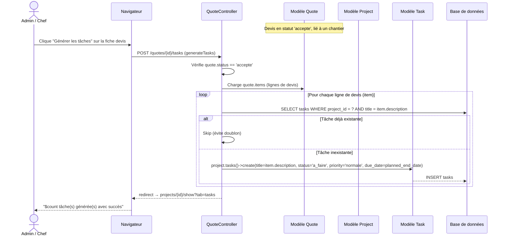
```mermaid
sequenceDiagram
    actor Admin as Admin / Chef
    participant B as Navigateur
    participant QC as QuoteController
    participant Q as Modèle Quote
    participant P as Modèle Project
    participant T as Modèle Task
    participant DB as Base de données

    Note over Q: Devis en statut 'accepte', lié à un chantier

    Admin->>B: Clique "Générer les tâches" sur la fiche devis
    B->>QC: POST /quotes/{id}/tasks (generateTasks)
    QC->>QC: Vérifie quote.status == 'accepte'
    QC->>Q: Charge quote.items (lignes de devis)

    loop Pour chaque ligne de devis (item)
        QC->>DB: SELECT tasks WHERE project_id = ? AND title = item.description
        alt Tâche déjà existante
            QC->>QC: Skip (évite doublon)
        else Tâche inexistante
            QC->>T: project.tasks()->create(title=item.description, status='a_faire', priority='normale', due_date=planned_end_date)
            T-->>DB: INSERT tasks
        end
    end

    QC-->>B: redirect → projects/{id}/show?tab=tasks
    B-->>Admin: "$count tâche(s) générée(s) avec succès"
```

---

## 7. Conversion Devis → Facture

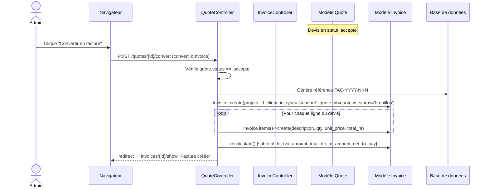
```mermaid
sequenceDiagram
    actor Admin as Admin
    participant B as Navigateur
    participant QC as QuoteController
    participant IC as InvoiceController
    participant Q as Modèle Quote
    participant I as Modèle Invoice
    participant DB as Base de données

    Note over Q: Devis en statut 'accepte'

    Admin->>B: Clique "Convertir en facture"
    B->>QC: POST /quotes/{id}/convert (convertToInvoice)
    QC->>QC: Vérifie quote.status == 'accepte'
    QC->>DB: Génère référence FAC-YYYY-NNN
    QC->>I: Invoice::create(project_id, client_id, type='standard', quote_id=quote.id, status='brouillon')

    loop Pour chaque ligne du devis
        QC->>I: invoice.items()->create(description, qty, unit_price, total_ht)
    end

    QC->>I: recalculate() [subtotal_ht, tva_amount, total_ttc, rg_amount, net_to_pay]
    QC-->>B: redirect → invoices/{id}/show "Facture créée"
```

---

## 8. Cycle de vie d'une Facture

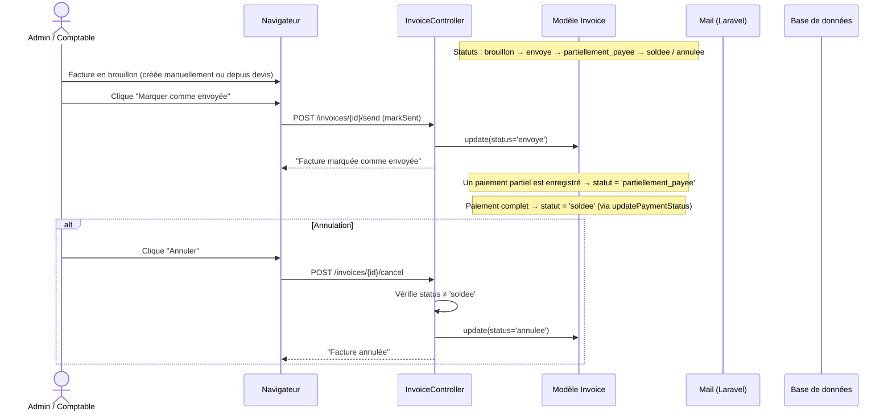
```mermaid
sequenceDiagram
    actor Admin as Admin / Comptable
    participant B as Navigateur
    participant IC as InvoiceController
    participant I as Modèle Invoice
    participant Mail as Mail (Laravel)
    participant DB as Base de données

    Note over I: Statuts : brouillon → envoye → partiellement_payee → soldee / annulee

    Admin->>B: Facture en brouillon (créée manuellement ou depuis devis)
    Admin->>B: Clique "Marquer comme envoyée"
    B->>IC: POST /invoices/{id}/send (markSent)
    IC->>I: update(status='envoye')
    IC-->>B: "Facture marquée comme envoyée"

    Note over I: Un paiement partiel est enregistré → statut = 'partiellement_payee'
    Note over I: Paiement complet → statut = 'soldee' (via updatePaymentStatus)

    alt Annulation
        Admin->>B: Clique "Annuler"
        B->>IC: POST /invoices/{id}/cancel
        IC->>IC: Vérifie status ≠ 'soldee'
        IC->>I: update(status='annulee')
        IC-->>B: "Facture annulée"
    end
```

---

## 9. Enregistrement d'un Paiement

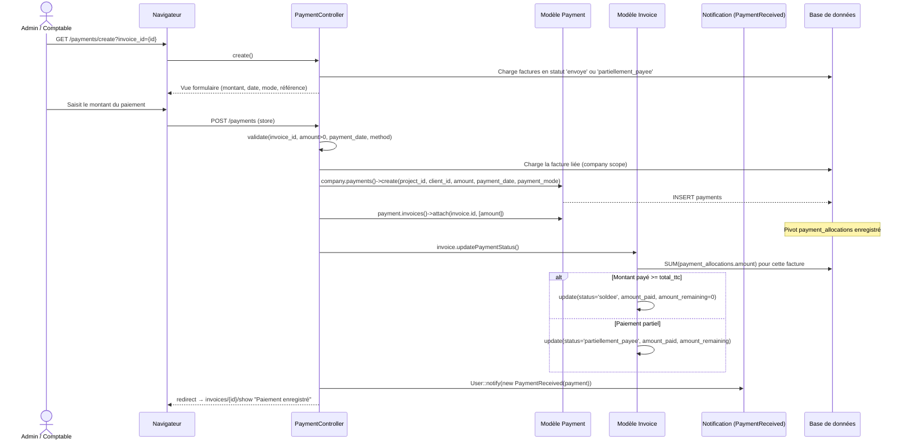
```mermaid
sequenceDiagram
    actor Admin as Admin / Comptable
    participant B as Navigateur
    participant PC as PaymentController
    participant P as Modèle Payment
    participant I as Modèle Invoice
    participant Notif as Notification (PaymentReceived)
    participant DB as Base de données

    Admin->>B: GET /payments/create?invoice_id={id}
    B->>PC: create()
    PC->>DB: Charge factures en statut 'envoye' ou 'partiellement_payee'
    PC-->>B: Vue formulaire (montant, date, mode, référence)

    Admin->>B: Saisit le montant du paiement
    B->>PC: POST /payments (store)
    PC->>PC: validate(invoice_id, amount>0, payment_date, method)
    PC->>DB: Charge la facture liée (company scope)
    PC->>P: company.payments()->create(project_id, client_id, amount, payment_date, payment_mode)
    P-->>DB: INSERT payments
    PC->>P: payment.invoices()->attach(invoice.id, [amount])
    Note over DB: Pivot payment_allocations enregistré

    PC->>I: invoice.updatePaymentStatus()
    I->>DB: SUM(payment_allocations.amount) pour cette facture
    alt Montant payé >= total_ttc
        I->>I: update(status='soldee', amount_paid, amount_remaining=0)
    else Paiement partiel
        I->>I: update(status='partiellement_payee', amount_paid, amount_remaining)
    end

    PC->>Notif: User::notify(new PaymentReceived(payment))
    PC-->>B: redirect → invoices/{id}/show "Paiement enregistré"
```

---

## 10. Cycle de vie d'une Dépense (workflow validation)

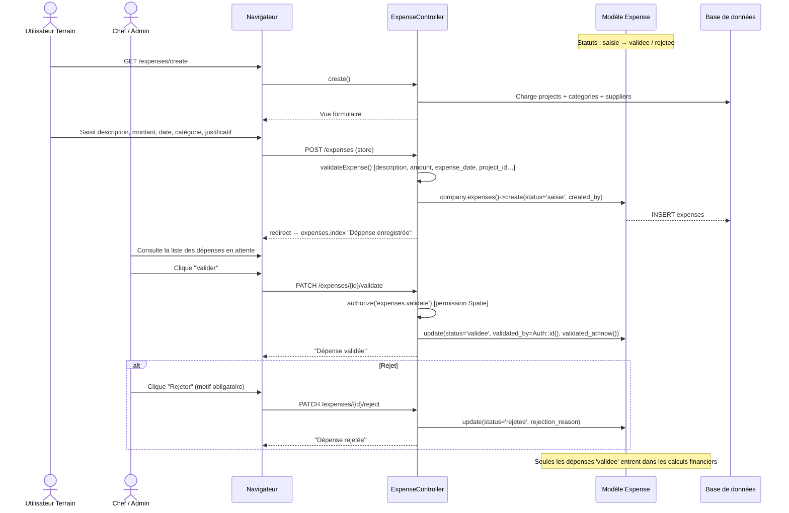
```mermaid
sequenceDiagram
    actor Terrain as Utilisateur Terrain
    actor Chef as Chef / Admin
    participant B as Navigateur
    participant EC as ExpenseController
    participant E as Modèle Expense
    participant DB as Base de données

    Note over E: Statuts : saisie → validee / rejetee

    Terrain->>B: GET /expenses/create
    B->>EC: create()
    EC->>DB: Charge projects + categories + suppliers
    EC-->>B: Vue formulaire

    Terrain->>B: Saisit description, montant, date, catégorie, justificatif
    B->>EC: POST /expenses (store)
    EC->>EC: validateExpense() [description, amount, expense_date, project_id…]
    EC->>E: company.expenses()->create(status='saisie', created_by)
    E-->>DB: INSERT expenses
    EC-->>B: redirect → expenses.index "Dépense enregistrée"

    Chef->>B: Consulte la liste des dépenses en attente
    Chef->>B: Clique "Valider"
    B->>EC: PATCH /expenses/{id}/validate
    EC->>EC: authorize('expenses.validate') [permission Spatie]
    EC->>E: update(status='validee', validated_by=Auth::id(), validated_at=now())
    EC-->>B: "Dépense validée"

    alt Rejet
        Chef->>B: Clique "Rejeter" (motif obligatoire)
        B->>EC: PATCH /expenses/{id}/reject
        EC->>E: update(status='rejetee', rejection_reason)
        EC-->>B: "Dépense rejetée"
    end

    Note over E: Seules les dépenses 'validee' entrent dans les calculs financiers
```

---

## 11. Bon de Commande → Dépense automatique

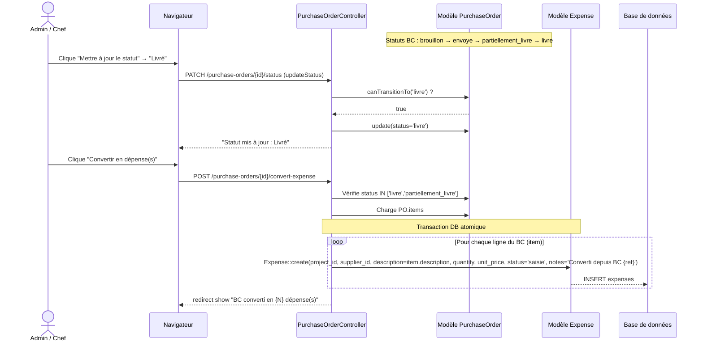
```mermaid
sequenceDiagram
    actor Admin as Admin / Chef
    participant B as Navigateur
    participant POC as PurchaseOrderController
    participant PO as Modèle PurchaseOrder
    participant E as Modèle Expense
    participant DB as Base de données

    Note over PO: Statuts BC : brouillon → envoye → partiellement_livre → livre

    Admin->>B: Clique "Mettre à jour le statut" → "Livré"
    B->>POC: PATCH /purchase-orders/{id}/status (updateStatus)
    POC->>PO: canTransitionTo('livre') ?
    PO-->>POC: true
    POC->>PO: update(status='livre')
    POC-->>B: "Statut mis à jour : Livré"

    Admin->>B: Clique "Convertir en dépense(s)"
    B->>POC: POST /purchase-orders/{id}/convert-expense
    POC->>PO: Vérifie status IN ['livre','partiellement_livre']
    POC->>PO: Charge PO.items

    Note over POC,E: Transaction DB atomique

    loop Pour chaque ligne du BC (item)
        POC->>E: Expense::create(project_id, supplier_id, description=item.description, quantity, unit_price, status='saisie', notes='Converti depuis BC {ref}')
        E-->>DB: INSERT expenses
    end

    POC-->>B: redirect show "BC converti en {N} dépense(s)"
```

---

## 12. Cycle de vie d'un Chantier

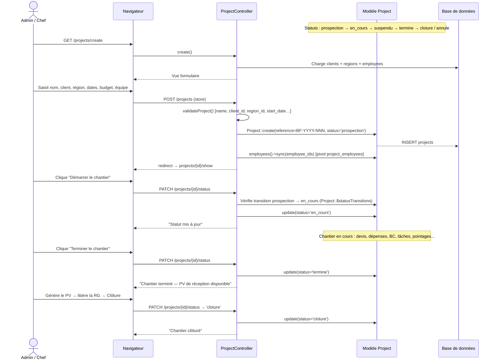
```mermaid
sequenceDiagram
    actor Admin as Admin / Chef
    participant B as Navigateur
    participant PC as ProjectController
    participant P as Modèle Project
    participant DB as Base de données

    Note over P: Statuts : prospection → en_cours → suspendu → termine → cloture / annule

    Admin->>B: GET /projects/create
    B->>PC: create()
    PC->>DB: Charge clients + regions + employees
    PC-->>B: Vue formulaire

    Admin->>B: Saisit nom, client, région, dates, budget, équipe
    B->>PC: POST /projects (store)
    PC->>PC: validateProject() [name, client_id, region_id, start_date…]
    PC->>P: Project::create(reference=BF-YYYY-NNN, status='prospection')
    P-->>DB: INSERT projects
    PC->>P: employees()->sync(employee_ids) [pivot project_employees]
    PC-->>B: redirect → projects/{id}/show

    Admin->>B: Clique "Démarrer le chantier"
    B->>PC: PATCH /projects/{id}/status
    PC->>P: Vérifie transition prospection → en_cours (Project::$statusTransitions)
    PC->>P: update(status='en_cours')
    PC-->>B: "Statut mis à jour"

    Note over P: Chantier en cours : devis, dépenses, BC, tâches, pointages...

    Admin->>B: Clique "Terminer le chantier"
    B->>PC: PATCH /projects/{id}/status
    PC->>P: update(status='termine')
    PC-->>B: "Chantier terminé — PV de réception disponible"

    Admin->>B: Génère le PV → libère la RG → Clôture
    B->>PC: PATCH /projects/{id}/status → 'cloture'
    PC->>P: update(status='cloture')
    PC-->>B: "Chantier clôturé"
```

---

## 13. Cycle de vie d'un Avenant

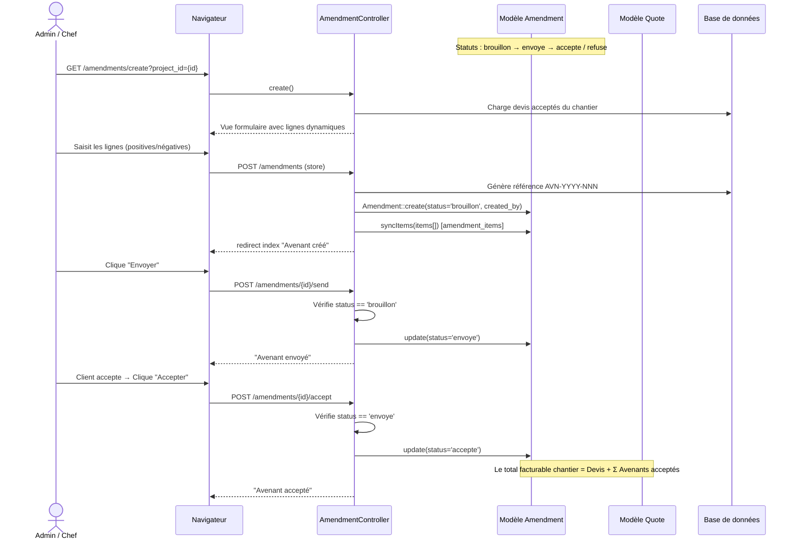
```mermaid
sequenceDiagram
    actor Admin as Admin / Chef
    participant B as Navigateur
    participant AC as AmendmentController
    participant A as Modèle Amendment
    participant Q as Modèle Quote
    participant DB as Base de données

    Note over A: Statuts : brouillon → envoye → accepte / refuse

    Admin->>B: GET /amendments/create?project_id={id}
    B->>AC: create()
    AC->>DB: Charge devis acceptés du chantier
    AC-->>B: Vue formulaire avec lignes dynamiques

    Admin->>B: Saisit les lignes (positives/négatives)
    B->>AC: POST /amendments (store)
    AC->>DB: Génère référence AVN-YYYY-NNN
    AC->>A: Amendment::create(status='brouillon', created_by)
    AC->>A: syncItems(items[]) [amendment_items]
    AC-->>B: redirect index "Avenant créé"

    Admin->>B: Clique "Envoyer"
    B->>AC: POST /amendments/{id}/send
    AC->>AC: Vérifie status == 'brouillon'
    AC->>A: update(status='envoye')
    AC-->>B: "Avenant envoyé"

    Admin->>B: Client accepte → Clique "Accepter"
    B->>AC: POST /amendments/{id}/accept
    AC->>AC: Vérifie status == 'envoye'
    AC->>A: update(status='accepte')
    Note over A,Q: Le total facturable chantier = Devis + Σ Avenants acceptés
    AC-->>B: "Avenant accepté"
```

---

## 14. PV de Réception & Libération de la Retenue de Garantie

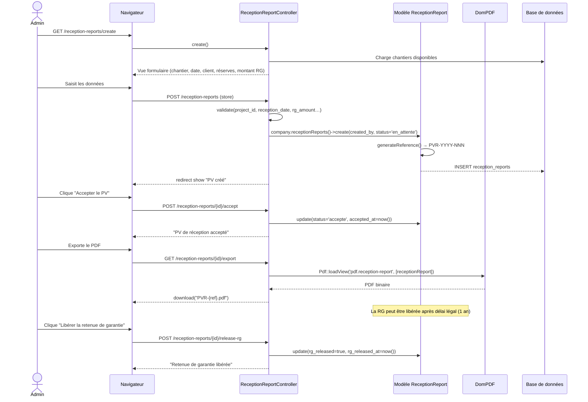
```mermaid
sequenceDiagram
    actor Admin as Admin
    participant B as Navigateur
    participant RRC as ReceptionReportController
    participant RR as Modèle ReceptionReport
    participant PDF as DomPDF
    participant DB as Base de données

    Admin->>B: GET /reception-reports/create
    B->>RRC: create()
    RRC->>DB: Charge chantiers disponibles
    RRC-->>B: Vue formulaire (chantier, date, client, réserves, montant RG)

    Admin->>B: Saisit les données
    B->>RRC: POST /reception-reports (store)
    RRC->>RRC: validate(project_id, reception_date, rg_amount…)
    RRC->>RR: company.receptionReports()->create(created_by, status='en_attente')
    RR->>RR: generateReference() → PVR-YYYY-NNN
    RR-->>DB: INSERT reception_reports
    RRC-->>B: redirect show "PV créé"

    Admin->>B: Clique "Accepter le PV"
    B->>RRC: POST /reception-reports/{id}/accept
    RRC->>RR: update(status='accepte', accepted_at=now())
    RRC-->>B: "PV de réception accepté"

    Admin->>B: Exporte le PDF
    B->>RRC: GET /reception-reports/{id}/export
    RRC->>PDF: Pdf::loadView('pdf.reception-report', [receptionReport])
    PDF-->>RRC: PDF binaire
    RRC-->>B: download("PVR-{ref}.pdf")

    Note over RR: La RG peut être libérée après délai légal (1 an)

    Admin->>B: Clique "Libérer la retenue de garantie"
    B->>RRC: POST /reception-reports/{id}/release-rg
    RRC->>RR: update(rg_released=true, rg_released_at=now())
    RRC-->>B: "Retenue de garantie libérée"
```

---

## 15. Mouvement de Stock (Entrée / Sortie)

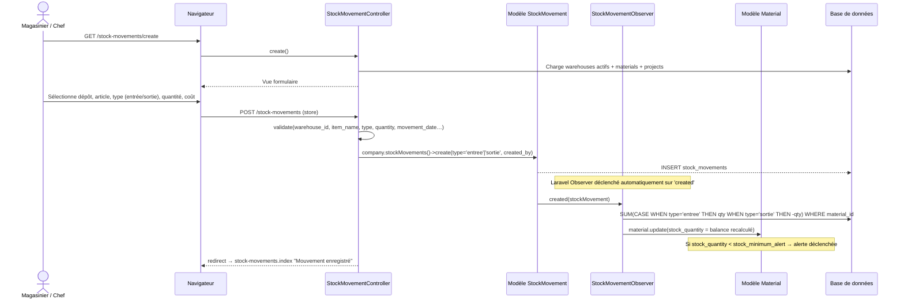
```mermaid
sequenceDiagram
    actor User as Magasinier / Chef
    participant B as Navigateur
    participant SMC as StockMovementController
    participant SM as Modèle StockMovement
    participant Obs as StockMovementObserver
    participant Mat as Modèle Material
    participant DB as Base de données

    User->>B: GET /stock-movements/create
    B->>SMC: create()
    SMC->>DB: Charge warehouses actifs + materials + projects
    SMC-->>B: Vue formulaire

    User->>B: Sélectionne dépôt, article, type (entrée/sortie), quantité, coût
    B->>SMC: POST /stock-movements (store)
    SMC->>SMC: validate(warehouse_id, item_name, type, quantity, movement_date…)
    SMC->>SM: company.stockMovements()->create(type='entree'|'sortie', created_by)
    SM-->>DB: INSERT stock_movements

    Note over Obs: Laravel Observer déclenché automatiquement sur 'created'
    SM->>Obs: created(stockMovement)
    Obs->>DB: SUM(CASE WHEN type='entree' THEN qty WHEN type='sortie' THEN -qty) WHERE material_id
    Obs->>Mat: material.update(stock_quantity = balance recalculé)

    Note over Mat: Si stock_quantity < stock_minimum_alert → alerte déclenchée

    SMC-->>B: redirect → stock-movements.index "Mouvement enregistré"
```

---

## 16. Transfert de Stock entre Dépôts

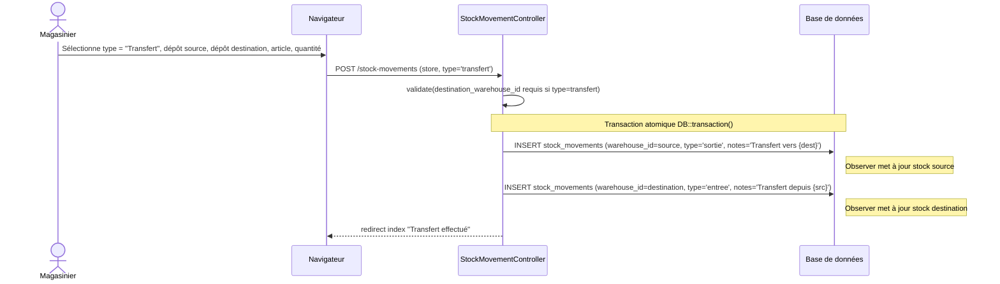
```mermaid
sequenceDiagram
    actor User as Magasinier
    participant B as Navigateur
    participant SMC as StockMovementController
    participant DB as Base de données

    User->>B: Sélectionne type = "Transfert", dépôt source, dépôt destination, article, quantité
    B->>SMC: POST /stock-movements (store, type='transfert')
    SMC->>SMC: validate(destination_warehouse_id requis si type=transfert)

    Note over SMC,DB: Transaction atomique DB::transaction()

    SMC->>DB: INSERT stock_movements (warehouse_id=source, type='sortie', notes='Transfert vers {dest}')
    Note right of DB: Observer met à jour stock source
    SMC->>DB: INSERT stock_movements (warehouse_id=destination, type='entree', notes='Transfert depuis {src}')
    Note right of DB: Observer met à jour stock destination

    SMC-->>B: redirect index "Transfert effectué"
```

---

## 17. Calcul DBE (Coefficient K) — AJAX

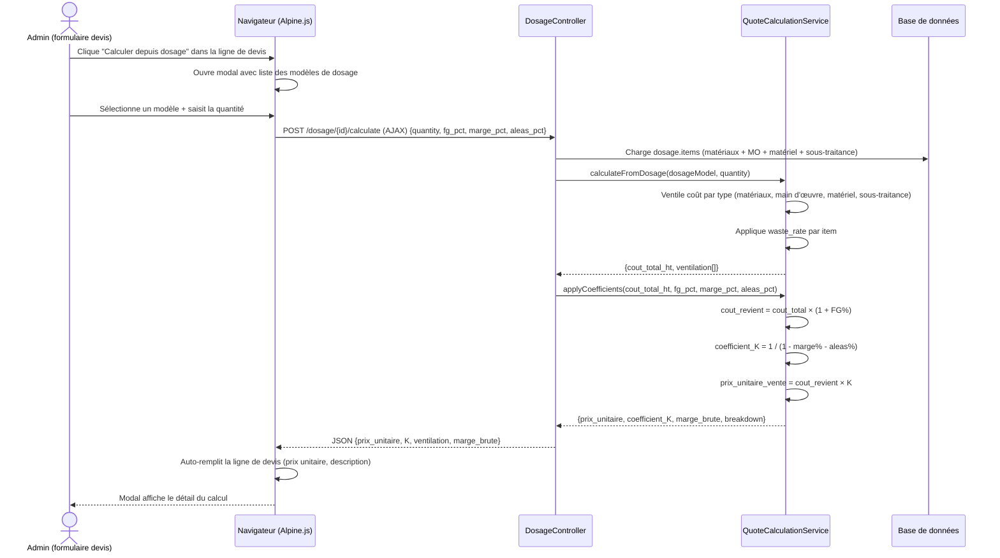
```mermaid
sequenceDiagram
    actor Admin as Admin (formulaire devis)
    participant B as Navigateur (Alpine.js)
    participant DC as DosageController
    participant QCS as QuoteCalculationService
    participant DB as Base de données

    Admin->>B: Clique "Calculer depuis dosage" dans la ligne de devis
    B->>B: Ouvre modal avec liste des modèles de dosage
    Admin->>B: Sélectionne un modèle + saisit la quantité

    B->>DC: POST /dosage/{id}/calculate (AJAX) {quantity, fg_pct, marge_pct, aleas_pct}
    DC->>DB: Charge dosage.items (matériaux + MO + matériel + sous-traitance)
    DC->>QCS: calculateFromDosage(dosageModel, quantity)
    QCS->>QCS: Ventile coût par type (matériaux, main d'œuvre, matériel, sous-traitance)
    QCS->>QCS: Applique waste_rate par item
    QCS-->>DC: {cout_total_ht, ventilation[]}

    DC->>QCS: applyCoefficients(cout_total_ht, fg_pct, marge_pct, aleas_pct)
    QCS->>QCS: cout_revient = cout_total × (1 + FG%)
    QCS->>QCS: coefficient_K = 1 / (1 - marge% - aleas%)
    QCS->>QCS: prix_unitaire_vente = cout_revient × K
    QCS-->>DC: {prix_unitaire, coefficient_K, marge_brute, breakdown}

    DC-->>B: JSON {prix_unitaire, K, ventilation, marge_brute}
    B->>B: Auto-remplit la ligne de devis (prix unitaire, description)
    B-->>Admin: Modal affiche le détail du calcul
```

---

## 18. Pointage d'un Salarié

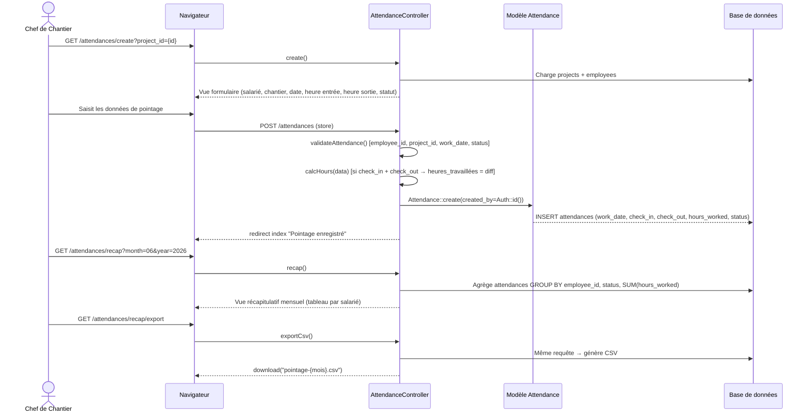
```mermaid
sequenceDiagram
    actor Chef as Chef de Chantier
    participant B as Navigateur
    participant AC as AttendanceController
    participant Att as Modèle Attendance
    participant DB as Base de données

    Chef->>B: GET /attendances/create?project_id={id}
    B->>AC: create()
    AC->>DB: Charge projects + employees
    AC-->>B: Vue formulaire (salarié, chantier, date, heure entrée, heure sortie, statut)

    Chef->>B: Saisit les données de pointage
    B->>AC: POST /attendances (store)
    AC->>AC: validateAttendance() [employee_id, project_id, work_date, status]
    AC->>AC: calcHours(data) [si check_in + check_out → heures_travaillées = diff]
    AC->>Att: Attendance::create(created_by=Auth::id())
    Att-->>DB: INSERT attendances (work_date, check_in, check_out, hours_worked, status)
    AC-->>B: redirect index "Pointage enregistré"

    Chef->>B: GET /attendances/recap?month=06&year=2026
    B->>AC: recap()
    AC->>DB: Agrège attendances GROUP BY employee_id, status, SUM(hours_worked)
    AC-->>B: Vue récapitulatif mensuel (tableau par salarié)

    Chef->>B: GET /attendances/recap/export
    B->>AC: exportCsv()
    AC->>DB: Même requête → génère CSV
    AC-->>B: download("pointage-{mois}.csv")
```

---

## 19. Upload sécurisé d'un Document

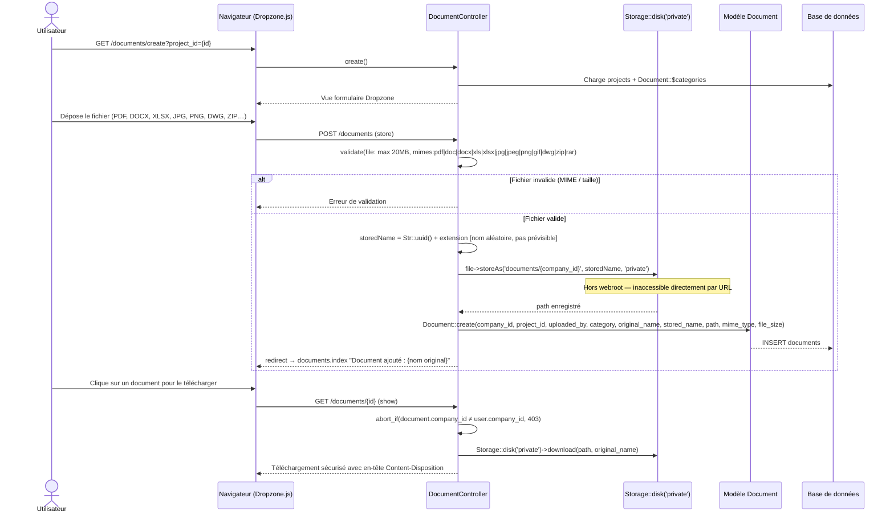
```mermaid
sequenceDiagram
    actor User as Utilisateur
    participant B as Navigateur (Dropzone.js)
    participant DC as DocumentController
    participant Storage as Storage::disk('private')
    participant Doc as Modèle Document
    participant DB as Base de données

    User->>B: GET /documents/create?project_id={id}
    B->>DC: create()
    DC->>DB: Charge projects + Document::$categories
    DC-->>B: Vue formulaire Dropzone

    User->>B: Dépose le fichier (PDF, DOCX, XLSX, JPG, PNG, DWG, ZIP…)
    B->>DC: POST /documents (store)
    DC->>DC: validate(file: max 20MB, mimes:pdf|doc|docx|xls|xlsx|jpg|jpeg|png|gif|dwg|zip|rar)

    alt Fichier invalide (MIME / taille)
        DC-->>B: Erreur de validation
    else Fichier valide
        DC->>DC: storedName = Str::uuid() + extension [nom aléatoire, pas prévisible]
        DC->>Storage: file->storeAs('documents/{company_id}', storedName, 'private')
        Note over Storage: Hors webroot — inaccessible directement par URL
        Storage-->>DC: path enregistré

        DC->>Doc: Document::create(company_id, project_id, uploaded_by, category, original_name, stored_name, path, mime_type, file_size)
        Doc-->>DB: INSERT documents
        DC-->>B: redirect → documents.index "Document ajouté : {nom original}"
    end

    User->>B: Clique sur un document pour le télécharger
    B->>DC: GET /documents/{id} (show)
    DC->>DC: abort_if(document.company_id ≠ user.company_id, 403)
    DC->>Storage: Storage::disk('private')->download(path, original_name)
    DC-->>B: Téléchargement sécurisé avec en-tête Content-Disposition
```

---

## 20. Notification in-app (cloche topbar)

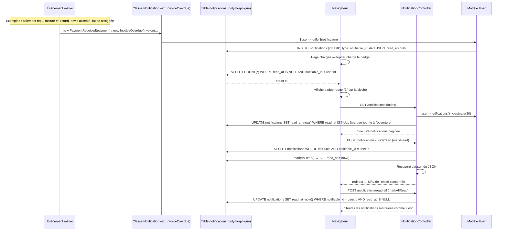
```mermaid
sequenceDiagram
    participant Event as Événement métier
    participant Notif as Classe Notification (ex: InvoiceOverdue)
    participant DB as Table notifications (polymorphique)
    participant B as Navigateur
    participant NC as NotificationController
    participant User as Modèle User

    Note over Event: Exemples : paiement reçu, facture en retard, devis accepté, tâche assignée

    Event->>Notif: new PaymentReceived(payment) / new InvoiceOverdue(invoice)…
    Notif->>User: $user->notify($notification)
    User->>DB: INSERT notifications (id UUID, type, notifiable_id, data JSON, read_at=null)

    B->>B: Page chargée — topbar charge le badge
    B->>DB: SELECT COUNT(*) WHERE read_at IS NULL AND notifiable_id = user.id
    DB-->>B: count = 3
    B->>B: Affiche badge rouge "3" sur la cloche

    B->>NC: GET /notifications (index)
    NC->>User: user->notifications()->paginate(30)
    NC->>DB: UPDATE notifications SET read_at=now() WHERE read_at IS NULL [marque-tout-lu à l'ouverture]
    NC-->>B: Vue liste notifications paginée

    B->>NC: POST /notifications/{uuid}/read (markRead)
    NC->>DB: SELECT notifications WHERE id = uuid AND notifiable_id = user.id
    NC->>DB: markAsRead() → SET read_at = now()
    NC->>NC: Récupère data.url du JSON
    NC-->>B: redirect → URL de l'entité concernée

    B->>NC: POST /notifications/read-all (markAllRead)
    NC->>DB: UPDATE notifications SET read_at=now() WHERE notifiable_id = user.id AND read_at IS NULL
    NC-->>B: "Toutes les notifications marquées comme lues"
```

---

## 21. Expiration automatique des Devis (Scheduler)

```mermaid
sequenceDiagram
    participant Cron as Cron (serveur)
    participant Sched as Laravel Scheduler (console.php)
    participant Cmd as MarkQuotesExpired (Artisan Command)
    participant DB as Base de données
    participant Q as Modèle Quote

    Note over Cron: Cron job quotidien : php artisan schedule:run

    Cron->>Sched: Déclenche à 02h00
    Sched->>Sched: Schedule::command(MarkQuotesExpired)->dailyAt('02:00')
    Sched->>Cmd: Handle()

    Cmd->>DB: SELECT quotes WHERE status='envoye' AND valid_until < NOW()
    DB-->>Cmd: Liste des devis expirés

    Cmd->>Q: ->update(['status' => 'expire'])
    Q-->>DB: UPDATE quotes SET status='expire' WHERE id IN (...)

    Cmd-->>Sched: "Marked {N} quote(s) as expired."
    Note over Sched: Log dans storage/logs/laravel.log
```

---

## Légende des acteurs

| Acteur | Description |
|--------|-------------|
| `Utilisateur` | Tout utilisateur authentifié |
| `Admin / Chef` | Rôle Admin Entreprise ou Chef de Chantier |
| `Terrain` | Rôle Terrain (accès limité) |
| `Client` | Personne externe (lien public uniquement) |
| `Cron` | Planificateur système du serveur |
| `DB` | Base de données MySQL |
| `Storage` | Disque `private` Laravel (hors webroot) |

## Légende des statuts

### Devis (`quotes.status`)
`brouillon` → `envoye` → `accepte` | `refuse` | `expire` | `annule`

### Factures (`invoices.status`)
`brouillon` → `envoye` → `partiellement_payee` → `soldee` | `annulee`

### Dépenses (`expenses.status`)
`saisie` → `validee` | `rejetee`

### Bons de commande (`purchase_orders.status`)
`brouillon` → `envoye` → `partiellement_livre` → `livre` | `annule`

### Tâches (`tasks.status`)
`a_faire` → `en_cours` | `en_pause` → `termine` | `annule`

### Chantiers (`projects.status`)
`prospection` → `en_cours` | `suspendu` → `termine` → `cloture` | `annule`

### Avenants (`amendments.status`)
`brouillon` → `envoye` → `accepte` | `refuse`
