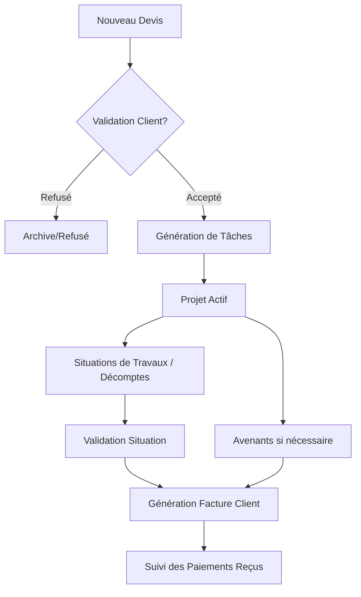
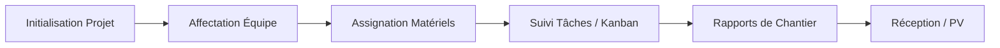
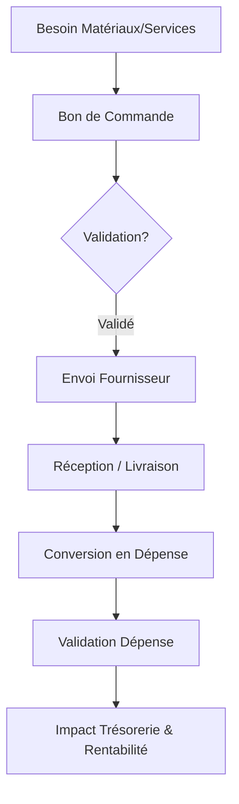

# 🏗️ Workflows de BuildFlow

Ce document détaille les processus métiers implémentés dans l'application BuildFlow pour la gestion de chantiers BTP.

> 🔔 **Note sur les Notifications** : L'icône 🔔 indique qu'une action déclenche une notification automatique aux utilisateurs concernés (Admin ou collaborateurs).

---

## 1. Cycle Commercial & Facturation (Ventes)
Le cycle de vente commence généralement par un devis et se termine par le paiement complet des factures.

### Étapes clés :
1.  **Devis (Quotes) :** Création détaillée avec sections et articles. C'est le contrat de base qui définit les prix unitaires.
2.  **Acceptation 🔔 :** L'acceptation (via lien public ou manuelle) active le chantier.
    - *Notification* : Le créateur du devis est alerté de l'acceptation par le client.
3.  **Avenants (Amendments) :** Documents contractuels pour ajouter ou déduire des travaux en cours de route.
4.  **Situations de Travaux / Décomptes (Progress Billing) :** 
    - C'est le cœur de la facturation BTP. Au lieu de facturer tout à la fin, on facture l'avancement réel (ex: 30% du terrassement fait ce mois-ci).
    - L'application calcule automatiquement le montant HT selon le pourcentage saisi, en tenant compte des quantités et prix du devis initial.
    - Elle gère le cumul : elle sait ce qui a été facturé dans les situations précédentes.
5.  **Factures Clients (Invoices) 🔔 :** 
    - Elles sont générées officiellement à partir d'une situation validée ou d'un devis.
    - L'application reporte automatiquement le client lié au projet pour éviter toute erreur de saisie.
    - Elle gère la **Retenue de Garantie (RG)** et la TVA de manière automatique.
    - *Notification (Auto)* : Un script quotidien identifie les factures en retard d'échéance et alerte les administrateurs.
6.  **Paiements Reçus (Payments) 🔔 :** 
    - Enregistrement des règlements clients (Virement, Cash, etc.).
    - Une facture peut être payée en plusieurs fois (Paiements partiels).
    - Le système calcule en temps réel le "Reste à payer" et met à jour le statut de la facture.
    - *Notification* : Les administrateurs reçoivent une alerte pour chaque nouveau paiement enregistré.

---

## 2. Cycle de Production & Chantier
La gestion opérationnelle une fois le chantier démarré.

### Étapes clés :
1.  **Affectation :** Liaison des salariés et matériels au projet. Définition des besoins (Requirements).
2.  **Pointage (Attendance) :** Relevé quotidien des heures travaillées par les salariés sur le terrain.
3.  **Tâches 🔔 :** Suivi via tableau Kanban, checklist et commentaires.
    - *Notification* : Les collaborateurs sont notifiés lorsqu'une nouvelle tâche leur est assignée.
4.  **Documents 🔔 :** Gestion des pièces jointes, plans et photos.
    - *Notification* : Les administrateurs sont alertés lors de l'ajout d'un nouveau document sur un projet.
5.  **Rapports de Chantier (Site Reports) :** Comptes-rendus réguliers avec photos et météo.
6.  **PV de Réception (Reception Reports) :** Clôture officielle du chantier avec levée de réserves et libération de retenue de garantie.

---

## 3. Cycle des Achats & Dépenses
Le suivi des coûts réels pour calculer la rentabilité.

### Étapes clés :
1.  **Bon de Commande (Purchase Order) :** Commande formelle auprès d'un fournisseur.
2.  **Dépenses (Expenses) :** Enregistrement de tous les coûts (Achats, Sous-traitance, Transport, etc.).
3.  **Lien BC -> Dépense :** Transformation d'un BC validé en dépense réelle pour éviter la double saisie.

---

## 4. Gestion des Stocks & Logistique
Suivi des mouvements de matériaux.

1.  **Bibliothèque de Prix (Materials) :** Référentiel des prix unitaires par région.
2.  **Modèles de Dosage (Dosage) :** Calculateur de quantités (ex: calcul du nombre de sacs de ciment pour un volume de béton).
3.  **Mouvements de Stock :**
    - **Entrée :** Approvisionnement (achat ou retour de chantier).
    - **Sortie :** Consommation sur chantier ou transfert.
4.  **Entrepôts (Warehouses) :** Chaque projet peut avoir son propre dépôt virtuel pour suivre le stock sur place.

---

## 5. Ressources Humaines (RH)
1.  **Fiche Salarié :** Coordonnées, spécialités et taux de salaire.
2.  **Planning & Affectation :** Suivi de la disponibilité.
3.  **Pointage & Recap :** Export des heures pour la préparation de la paie.

---

## 6. Analyse & Pilotage
- **Dashboard :** Vue globale (Ventes vs Achats).
- **Rapports Financiers :** Analyse de la marge par projet.
- **Journal de Bord (Project Logs) :** Historique automatique de toutes les actions importantes sur un chantier.
